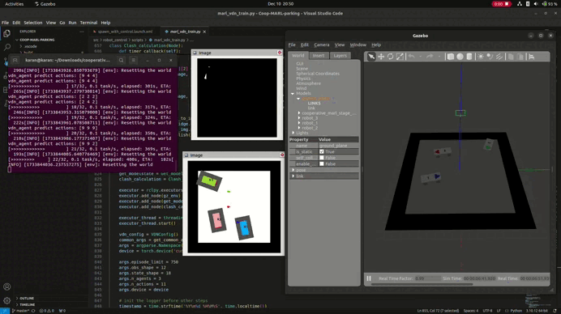

# Cooperative MARL simulation using ROS2 and Gazebo 

There are 3 car-like robots on the field, the field is 14x14 meter, in which the agents can move. There is a 2 meter wide area outside the field. If the center of any afgent crosses a boundary of the gray field, an episode ends. There is one goal point on the gray field for each agent. Each goal point not only has coordiantes, but also orientation.

There is a safety zone/ boundary across each agent surrounding it. If these zones overlap with each other, or this zone overlaps with the black region, negative reward will be applied.



**State**
- Location (x, y, $\theta$) of each agent and the difference of agent location and its respective goal i.e ($\Delta$ x, $\Delta$ y, $\Delta$ $\theta$).
- The state is described by 1-dimensional array with 18 elements.

**Observation Space**
- Each agent observes (x, y, $\theta$) and ($\Delta$ x, $\Delta$ y, $\Delta$ $\theta$).
- Each agent knows only its own goal only.
- Observation space is described by 1-D array with 12 elements.

**Actions**
- Each agent has 11 actions.
- 5 forward actions, 5 backward actions and 1 stop action.

**Reward**
- Single joint reward.
- Reward increases proportionally to each agent's distane to the goal and orientation difference.
- For each agent that has reached its own goal, a reward of 0.333 is given.
- If all agents reach their goal positions, a reward of 1 is given, and the episode ends.
- If a safe zone of any of the agents overlaps with another agents safe zone or the black are, the reward is deduced proportionally to the overlapping area.
- If the center of any agent crosses over the border of the gray and black regions, a reward of -1 is applied and the episode ends.

Here, [Value-Decomposition Networks](https://doi.org/10.48550/arXiv.1706.05296) is used. VDN copes with problem of cooperative multi-agent reinforcement learning with a single joint reward. Such problems are difficult because of large combined action, observation spaces and difficulty to determine an action that brings high reward not to a single agent bu to a whole team. VDN learns to decompose team value function into agent-wise value functions. The main assumption VDN makes and exploits is that the joint-value function for the system can be additively decomposed into value functions across agents. One approach to reducing the number of learnable parameters, is to share certain network weights between agents. Weight sharing also gives rise to the concept of agent invariance, which is useful for avoiding the lazy agent problem.

Thanks to [deep-marl-toolkit](https://github.com/jianzhnie/deep-marl-toolkit).

## Dependencies

1. ROS2 Humble
2. Gazebo Classic 11.10.2
```c++
sudo apt install ros-humble-gazebo-ros
sudo apt install ros-humble-gazebo-ros2-control
sudo apt install ros-humble-ros2-control
sudo apt install ros-humble-ros2-controllers
```
NOTE: There is a known bug of not activating multiple chainable controllers at once
https://github.com/ros-controls/ros2_control/issues/1400